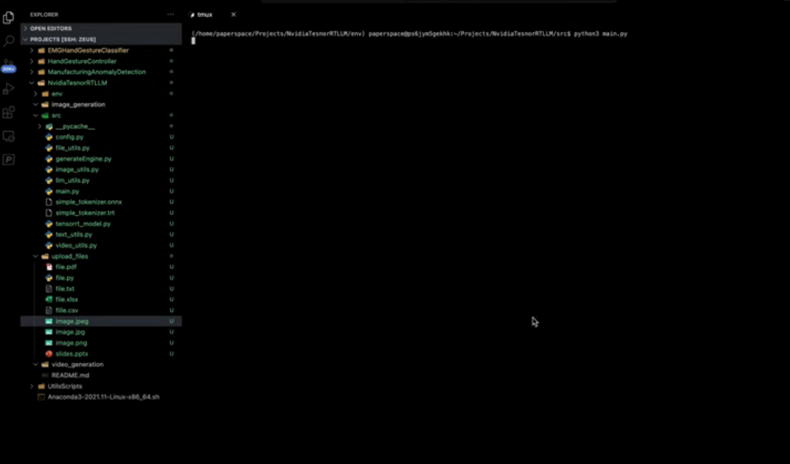
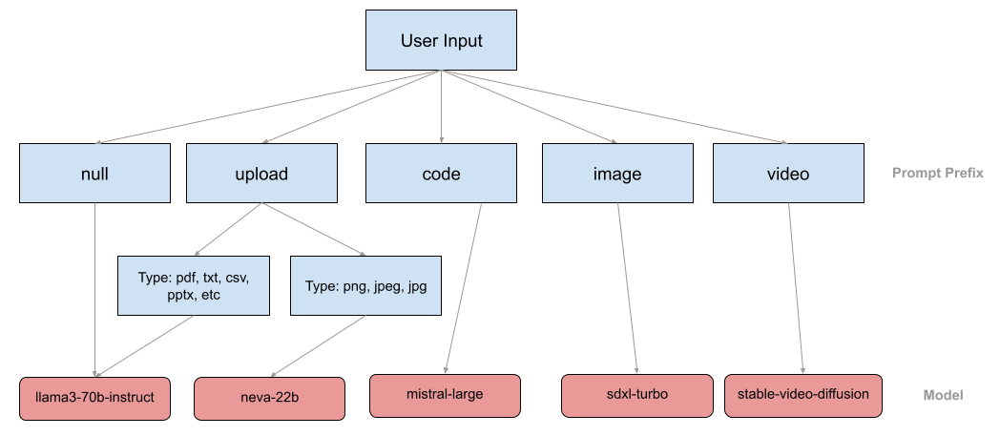

# TensorRT and Nvidia NeMo Terminal Assistant

**This project showcases an implementation of a terminal-based assistant using a collection of models powered by TensorRT and Nvidia NeMo. This assistant leverages various models for text processing, image generation, video creation, and more to provide a comprehensive and interactive user experience.**

---

**Technical Topics:** *Natural Language Processing, Image Generation, Video Generation, Model Inference, TensorRT, Nvidia NeMo*

**Tools / Technologies:** *Python, TensorRT, Nvidia NeMo, PyCUDA, PyTorch, PIL, Requests*

**Use Case:** *Terminal-based assistant capable of generating text responses, creating images from prompts, and generating videos from images.*

---

### Video Demo:

<a href="https://www.youtube.com/watch?v=13iVZZUfDa8">
    
</a>

---

### Technical Explanation:

#### High Level Ensemble Diagram:

<a>
    
</a>

#### Text Response Model -- [llm_utils.py](https://github.com/your-repo/TensorRTNeMoAssistantEnsemble/blob/main/llm_utils.py)

The text response script handles generating text responses using Nvidia NeMo models. It preprocesses the input text, generates responses, and post-processes the output.

1. **Input Preprocessing:**
   - **Text Truncation:**
     - Truncate input text to ensure it doesn't exceed maximum token limits.
   - **Text Normalization:**
     - Lowercase text and remove unwanted characters.

2. **Model Inference:**
   - **Generate Response:**
     - Use Nvidia NeMo's LLaMA model to generate text responses based on the processed input.

3. **Output Post-Processing:**
   - **Clean and Format Response:**
     - Clean the generated response and format it for user display.

**Input:** Text prompt  
**Output:** Generated text response  
**Capabilities:** Handles complex language understanding and generation tasks, maintaining context across interactions.

---

#### Image Generation Model -- [image_utils.py](https://github.com/your-repo/TensorRTNeMoAssistantEnsemble/blob/main/image_utils.py)

The image generation script handles creating images from text prompts using SDXL-Turbo API.

1. **API Request:**
   - **Generate Image:**
     - Send a request to the SDXL-Turbo API with the text prompt to generate an image.
   - **Save Image:**
     - Optionally save the generated image to a specified directory.

2. **Error Handling:**
   - **Response Validation:**
     - Check the API response for errors and handle them appropriately.

**Input:** Text prompt  
**Output:** Generated image (optionally saved)  
**Capabilities:** Generates high-quality images based on descriptive text prompts, useful for various creative and visualization tasks.

---

#### Video Generation Model -- [video_utils.py](https://github.com/your-repo/TensorRTNeMoAssistantEnsemble/blob/main/video_utils.py)

The video generation script handles creating videos from images using the Stable Video Diffusion API.

1. **API Request:**
   - **Generate Video:**
     - Send a request to the Stable Video Diffusion API with the base64 encoded image to generate a video.
   - **Save Video:**
     - Save the generated video to a specified directory.

2. **Error Handling:**
   - **Response Validation:**
     - Check the API response for errors and handle them appropriately.

**Input:** Base64 encoded image  
**Output:** Generated video (saved to directory)  
**Capabilities:** Creates dynamic video content from static images, enabling advanced visual storytelling and content creation.

---

#### TensorRT Model -- [tensorrt_model.py](https://github.com/your-repo/TensorRTNeMoAssistantEnsemble/blob/main/tensorrt_model.py)

The TensorRT model script manages loading, allocating buffers, and performing inference with TensorRT models.

1. **Engine Loading:**
   - **Load TensorRT Engine:**
     - Deserialize and load the TensorRT engine from a file.
   - **Allocate Buffers:**
     - Allocate necessary input and output buffers for inference.

2. **Inference:**
   - **Perform Inference:**
     - Run inference using the loaded TensorRT engine and return the results.

**Input:** Preprocessed input data  
**Output:** Inference results  
**Capabilities:** Optimized for high-performance inference, suitable for real-time applications requiring low latency.

---

#### File Processing Model -- [file_utils.py](https://github.com/your-repo/TensorRTNeMoAssistantEnsemble/blob/main/file_utils.py)

The file processing script handles parsing and extracting content from various file formats.

1. **File Parsing:**
   - **Supported Formats:**
     - Parse PDF, DOCX, PPTX, CSV, XLSX, TXT, and JSON files.
   - **Content Extraction:**
     - Extract text or data from the files and return it in a consistent format.

2. **Error Handling:**
   - **File Format Validation:**
     - Ensure the file format is supported and handle errors appropriately.

**Input:** File path  
**Output:** Extracted content as a string  
**Capabilities:** Efficiently processes and extracts information from a variety of document formats, supporting diverse data sources.

---

### Next Steps:

- Expand the project to include more functionalities such as real-time data processing.
- Improve the robustness of the models by incorporating more advanced data augmentation techniques.
- Optimize the inference pipeline for better performance and lower latency.

---

### Citations:

Model and Dataset Credits:

```
Nvidia NeMo: https://developer.nvidia.com/nvidia-nemo
TensorRT: https://developer.nvidia.com/tensorrt
```